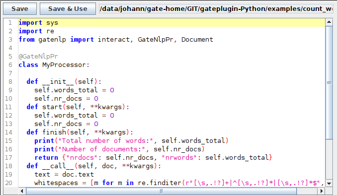
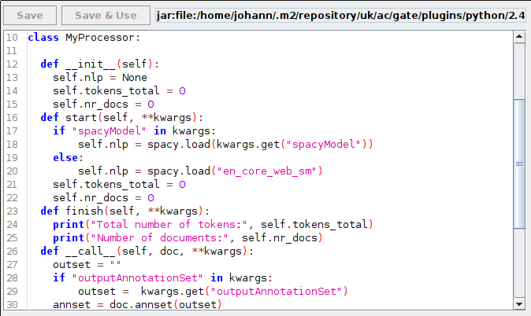

# The Python Editor

When a PythonPr is double clicked in the GUI, the Python editor pane is shown which can be used to view and edit the Python program code. This editor only has basic functionality, for a full Python IDE use an external editor.

The editor pane looks like this:

The top of the window shows two buttons and the location of the loaded python file. 

* Save: saves the current content of the editor to the python file from where it was loaded
* Save & Use: saves the current content and runs the Python checker on the file. If some syntax error is found the color of the location shown is turning red. If the problem gets fixed and "Save & Use" is used again, the color turns back to black.

It is possible to use Python programs which are loaded from a read-only file or from within the Plugin when a ready-made application is used. In that case the editor window shows the file but it cannot be modified and the buttos are greyed out:

## Editing the program with a separate editor

If the program is changed on disk by some other means, e.g. an external editor, the GATE Python editor does not recognize this automatically, nor will the PythonPr use the modified file automatically. 

In order to use the externally modified file. right click the PythonPr instance and choose "Reinitialize". This will show the updated content and make it available to the PR. 

